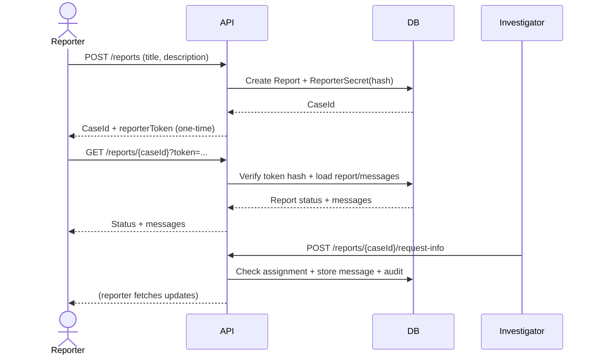

# Whistleblower Secure Design

## Requirements
- Anonymous employees can create reports without authentication.
- Reporters can follow case progress using a one-time token.
- Investigators can request more information from reporters.
- Investigators can update case status.
- Editors can access and update any case for oversight.
- All investigator actions are auditable.

## Security requirements
- No reporter identity is collected or stored by default.
- Reporter access tokens are high-entropy and stored only as salted hashes.
- Token verification uses constant-time comparison.
- Least-privilege access control for investigators and editors.
- Investigator actions require assignment checks.
- Audit trail records case actions and actors.
- Data at rest is stored in a database with enforced relationships.

## Use-cases
1. Anonymous reporter submits a report and receives a one-time token.
2. Reporter checks status and messages using the token.
3. Investigator requests more information from the reporter.
4. Investigator updates the case status.
5. Editor reviews or overrides case status and actions.

## Misuse-cases
- Attacker guesses a token to access a report.
  Mitigation: high-entropy tokens, hashed storage, constant-time verification.
- Insider investigator accesses an unassigned case.
  Mitigation: assignment checks, editor-only override, audit logs.
- Unauthorized user attempts to update status or request info.
  Mitigation: role-based policies, authentication required for investigator endpoints.
- Tampering with report history.
  Mitigation: append-only audit logs and message history.

## Sequence diagram (reporter flow)


## Component diagram (high level)
```mermaid
graph TD
    Reporter[Anonymous Reporter] --> API[Whistleblower API]
    Investigator[Investigator] --> API
    Editor[Editor] --> API

    API --> Auth[JWT Auth + Policies]
    API --> DB[(Database)]
    DB --> Reports[Reports]
    DB --> Secrets[ReporterSecret (hashed)]
    DB --> Messages[ReportMessages]
    DB --> Assignments[InvestigatorAssignments]
    DB --> Audit[AuditLog]
```