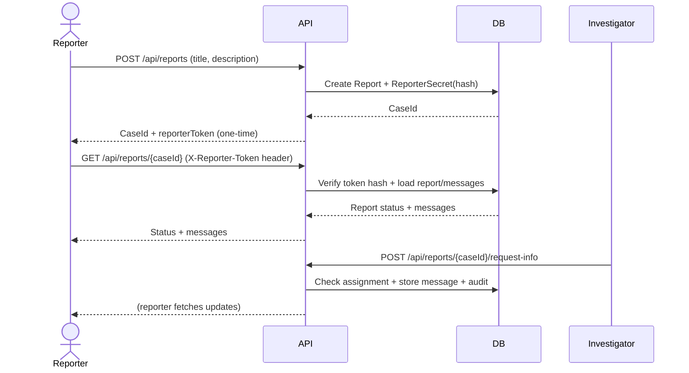
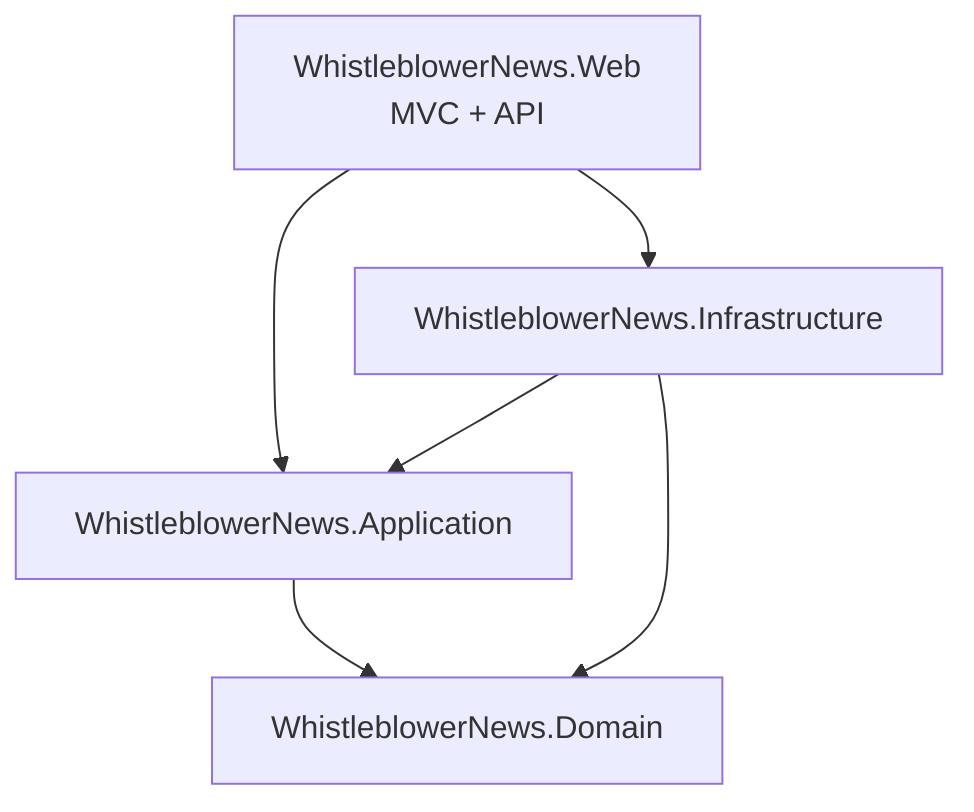
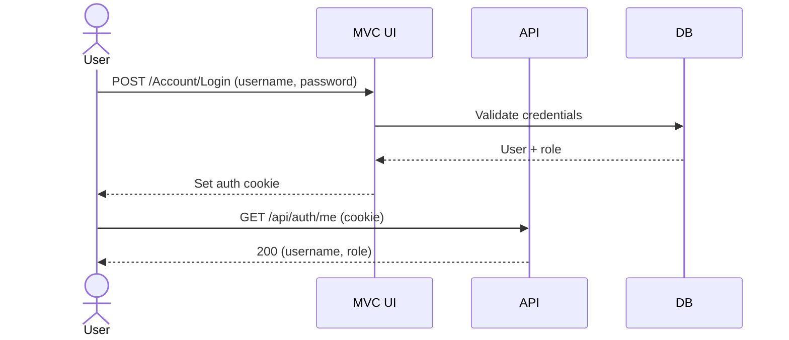

# Whistleblower Secure Design

## Requirements
- Anonymous employees can create reports without authentication.
- Reporters can follow case progress using a one-time token.
- Investigators can request more information from reporters.
- Investigators can update case status.
- Editors can access and update any case for oversight.
- All investigator actions are auditable.

## Security requirements
- No reporter identity is collected or stored by default.
- Reporter access tokens are high-entropy and stored only as salted hashes.
- Token verification uses constant-time comparison.
- Reporter token is sent via header `X-Reporter-Token` only.
- Rate limiting is applied to report submission and reporter token endpoints.
- Least-privilege access control for investigators and editors.
- Staff authentication uses HttpOnly cookies with role claims.
- Investigator actions require assignment checks.
- Audit trail records case actions and actors.
- Data at rest is stored in a database with enforced relationships.

## Use-cases
1. Anonymous reporter submits a report and receives a one-time token.
2. Reporter checks status and messages using the token.
3. Investigator requests more information from the reporter.
4. Investigator updates the case status.
5. Editor reviews or overrides case status and actions.

## Misuse-cases
- Attacker guesses a token to access a report.
  Mitigation: high-entropy tokens, hashed storage, constant-time verification.
- Insider investigator accesses an unassigned case.
  Mitigation: assignment checks, editor-only override, audit logs.
- Unauthorized user attempts to update status or request info.
  Mitigation: role-based policies, authentication required for investigator endpoints.
- Tampering with report history.
  Mitigation: append-only audit logs and message history.

## Threat model (mini)

| Threat | Impact | Mitigation | Residual Risk |
| ------ | ------ | ---------- | ------------- |
| Token leakage via URLs/logs | Unauthorized report access | Header-based token transport, no token logging, no token in URLs | Token could still be phished or shared |
| Token brute force / enumeration | Unauthorized access | High-entropy tokens, hashed storage, rate limiting on token endpoint | Distributed attacks may still probe |
| Investigator abuse / overreach | Unauthorized case changes | Role policies + assignment checks + audit log | Insider risk remains, needs monitoring |
| SQL injection | Data compromise | EF Core parameterization, no raw SQL endpoints | Misuse of raw SQL in future changes |
| Sensitive data exposure via error messages | Information leakage | Generic error messages, no secret values returned | New endpoints could add verbose errors |
| Insider access to audit logs | Privacy breach | No public audit endpoints; DB access restricted | DB admin access still sensitive |

## Audit logging
The audit log is append-only; the API exposes no update/delete endpoints for audit entries.
Audit entries are only inserted by the audit service (no update/delete logic in code).
IP address is captured from `HttpContext.Connection.RemoteIpAddress`; in production behind proxies,
enable forwarded headers to record the original client IP.

## PoC limitations / production hardening
- Rate limit tuning and WAF integration for real-world traffic patterns.
- Enforce header-only token transport and HTTPS-only access.
- Secret storage hardening (rotation, HSM/KMS-backed secrets if applicable).
- Monitoring and alerting for abnormal access patterns and investigator actions.
- Optional secure message channel and metadata minimization for reporters.

## HTTP security headers
- HSTS is enabled outside Development to enforce HTTPS.
- CSP restricts scripts and styles to self-hosted assets (no inline scripts) and blocks
  embedded objects (`object-src 'none'`), external form posts (`form-action 'self'`),
  and clickjacking (`frame-ancestors 'none'`).
- Referrer-Policy set to `strict-origin-when-cross-origin` to reduce leakage.
- Frame embedding blocked via CSP `frame-ancestors 'none'` and X-Frame-Options for legacy clients.

Tradeoff: inline scripts are disallowed. If a future UI requires inline scripts,
prefer moving them to static files or using CSP nonces.

## Sequence diagram (reporter flow)


## Component diagram (high level)
```mermaid
graph TD
    Reporter[Anonymous Reporter] --> API[Whistleblower API]
    Investigator[Investigator] --> API
    Editor[Editor] --> API

    API --> Auth[Cookie Auth + Policies]
    API --> DB[(Database)]
    DB --> Reports[Reports]
    DB --> Secrets[ReporterSecret (hashed)]
    DB --> Messages[ReportMessages]
    DB --> Assignments[InvestigatorAssignments]
    DB --> Audit[AuditLog]
```

## Architecture (Clean Architecture)


## Auth flow (cookie)

